# Awesome Distributed NoSQL Database 🚀

  

  
  
  
  
  

---

## 📌 Overview & SEO Summary

Welcome to the ultimate curated directory of **Distributed NoSQL Databases**, covering cloud-native **SaaS Database-as-a-Service (DBaaS)** offerings and high-performance **Open-Source GitHub projects**. 

Modern cloud architectures demand databases built for horizontal scalability, zero single points of failure, multi-region high availability, and flexible schema designs. This repository acts as a comprehensive reference guide for database architects, backend software engineers, DevOps engineers, and system designers looking to evaluate NoSQL solutions across **Key-Value Stores**, **Document Databases**, **Wide-Column Stores**, **Graph Databases**, **Distributed SQL (NewSQL)**, and **Vector Databases** for AI / LLM workloads.

---

## 📖 Table of Contents

- [☁️ SaaS / Managed DBaaS Platforms](#️-saas--managed-dbaas-platforms)
- [🔓 Open-Source GitHub Projects](#-open-source-github-projects)
- [🤝 How to Contribute](#-how-to-contribute)
- [❤️ Support & Sponsorship](#️-support--sponsorship)
- [⚠️ Disclaimer](#%EF%B8%8F-disclaimer)
- [⭐ Star History](#-star-history)

---

## ☁️ SaaS / Managed DBaaS Platforms

> **📊 Market Context & Fragment Analysis**: The global NoSQL database market is estimated at **~$12 Billion in 2026** and is projected to reach **~$35 Billion by 2032** (CAGR ~16.5%). The sector is **moderately fragmented**: cloud hyper-scalers (AWS, Azure, Google Cloud) command massive market share for general key-value and document workloads, while specialized independent vendors lead niche categories like Graph (Neo4j), Vector AI (Pinecone, Qdrant), and High-Performance Cassandra (ScyllaDB). It is **not a winner-take-all market**, as enterprise architectures increasingly adopt multi-database polyglot persistence.

Below is a curated comparison of leading fully-managed NoSQL SaaS products, sorted in descending order by **Company Size (Annual Revenue / Valuation)**:

| Platform | Description | Pricing (Starting Paid Tier) | Free Tier / Trial Limits | Company Size (Revenue / Valuation) 🔽 |
| :--- | :--- | :--- | :--- | :--- |
| **[Amazon DynamoDB](https://aws.amazon.com/dynamodb/)** ⚡ | AWS fully managed key-value and document database delivering single-digit millisecond latency at any scale. | **Provisioned**: $0.00065/hr per WCU + $0.00013/hr per RCU (~$0.56/month WCU). **On-Demand**: $1.25 per million write units, $0.25 per million read units. | **Always Free Tier**: 25 GB storage + 25 WCU & 25 RCU provisioned capacity every month. | **~$638 Billion** *(Amazon FY2025 Revenue)* |
| **[Google Cloud Firestore](https://cloud.google.com/firestore)** 🔥 | Google serverless document database with real-time sync, offline client support, and automatic multi-region scaling. | **Reads**: $0.06 / 100k reads. **Writes**: $0.18 / 100k writes. **Storage**: $0.18/GB/month. | **Always Free Tier**: 1 GB storage, 50,000 reads/day, 20,000 writes/day, 20,000 deletes/day. | **~$350 Billion** *(Alphabet FY2025 Revenue)* |
| **[Microsoft Azure Cosmos DB](https://azure.microsoft.com/en-us/products/cosmos-db/)** 🌐 | Microsoft globally distributed, multi-model database supporting SQL, MongoDB, Cassandra, Gremlin, and Table APIs. | **Provisioned**: $0.008/hr per 100 RU/s (~$5.84/month). **Serverless**: $0.25 per 1 million RUs. | **Lifetime Free Tier**: 1,000 RU/s provisioned throughput + 25 GB storage free forever. | **~$281 Billion** *(Microsoft FY2025 Revenue)* |
| **[MongoDB Atlas](https://www.mongodb.com/atlas)** 🍃 | Fully managed multi-cloud document database platform with built-in search and vector search capabilities. | **Flex Tier**: Starts at $0.08/hr (~$58/month). **Dedicated M10**: Starts at $0.08/hr ($57.60/month base). | **Always Free M0 Cluster**: 512 MB storage, shared RAM, max 500 collections, 100 connections. | **~$2.0 Billion** *(Public MDB Revenue)* |
| **[Redis Cloud](https://redis.io/cloud/)** 🔴 | Fully managed Redis in-memory data store for caching, pub/sub, search, and real-time vector indexing. | **Essentials Paid**: 250 MB instance starting at $5.00/month. | **Essentials Free**: 30 MB memory, 30 max connections, 5 GB/month bandwidth limit. | **~$2.0 Billion** *(Estimated Private Valuation)* |
| **[Neo4j Aura](https://neo4j.com/cloud/aura/)** 🕸️ | Fully managed graph database service delivering native Cypher queries, graph algorithms, and vector search. | **AuraDB Professional**: $65.00/GB memory/month (1 GB cluster minimum). | **AuraDB Free**: 1 instance, 200k nodes, 400k relationships limit. | **~$2.0 Billion** *(Estimated Private Valuation)* |
| **[ScyllaDB Cloud](https://www.scylladb.com/)** 🚀 | High-performance C++ NoSQL database fully compatible with Apache Cassandra and Amazon DynamoDB. | **On-Demand**: Smallest cluster node starting at $0.32/hr (~$230/month). | **30-Day Free Trial**: AWS t4g.medium or GCP e2-medium instance trial (No credit card needed). | **~$100 Million** *(Private Funding & Est. Valuation)* |
| **[Couchbase Capella](https://www.couchbase.com/products/capella/)** 🛋️ | Fully managed NoSQL JSON document database with SQL-like N1QL query support and mobile sync. | **Developer Tier**: Starts at $0.26/hr per node (~$190/month). | **30-Day Free Trial**: Full access trial cluster with 30-day expiration (No credit card required). | **~$100 Million** *(Private Est. Annual Revenue)* |
| **[Fauna](https://fauna.com/)** 💎 | Serverless, globally distributed document-relational database with strong ACID consistency and FQL v10. | **Individual Plan**: Starts at $25.00/month base subscription + compute/storage usage. | **Free Plan**: 100k Read Operations/month, 50k Write Operations/month, 1 GB storage. | **~$50 Million** *(Private Venture Funding Raised)* |
| **[DataStax Astra DB](https://www.datastax.com/products/datastax-astra)** 🌌 | Cloud-native Database-as-a-Service powered by Apache Cassandra with serverless vector search capabilities. | **Pay-As-You-Go**: $0.05 / 100k read operations, $0.15 / 100k write operations. | **Free Credit Tier**: $25.00 free credit per month (~80 million write ops / 20 GB storage). | **Acquired by IBM** *(IBM Revenue ~$62B/year)* |

---

## 🔓 Open-Source GitHub Projects

Below is a curated list of top open-source distributed NoSQL databases, sorted in descending order by **GitHub Star Count**:

| Repo | Description | License | Star Count & Stargazers Badge 🔽 |
| :--- | :--- | :--- | :--- |
| **[Redis](https://github.com/redis/redis)** 🔴 | In-memory data structure store used as a database, cache, streaming engine, and message broker. | BSD-3-Clause |  |
| **[TiDB](https://github.com/pingcap/tidb)** 💡 | Open-source distributed HTAP database compatible with MySQL protocol, delivering real-time OLTP/OLAP capabilities. | Apache-2.0 |  |
| **[Milvus](https://github.com/milvus-io/milvus)** 👁️ | Cloud-native vector database designed for enterprise AI applications, similarity search, and RAG pipelines. | Apache-2.0 |  |
| **[CockroachDB](https://github.com/cockroachdb/cockroach)** 🪲 | Cloud-native, distributed SQL database featuring strong consistency, multi-region ACID transactions, and PostgreSQL compatibility. | BSL 1.1 |  |
| **[MongoDB Community](https://github.com/mongodb/mongo)** 🍃 | Source-available document database platform storing data in flexible JSON-like BSON documents. | SSPL |  |
| **[RethinkDB](https://github.com/rethinkdb/rethinkdb)** 🔄 | Open-source JSON document database built for real-time applications with push-based changefeeds. | Apache-2.0 |  |
| **[Qdrant](https://github.com/qdrant/qdrant)** 🎯 | High-performance vector similarity search engine and vector database written in Rust with extended payload filtering. | Apache-2.0 |  |
| **[Weaviate](https://github.com/weaviate/weaviate)** 🧠 | Open-source vector database designed to store data objects and vector embeddings with GraphQL/REST endpoints. | BSD-3-Clause |  |
| **[ScyllaDB](https://github.com/scylladb/scylladb)** ⚡ | High-performance C++ drop-in replacement for Apache Cassandra offering 10x throughput and low tail latency. | AGPL-3.0 |  |
| **[Neo4j Community](https://github.com/neo4j/neo4j)** 🕸️ | Enterprise graph database management system delivering high-performance graph property indexing and Cypher queries. | GPL-3.0 |  |
| **[Apache Cassandra](https://github.com/apache/cassandra)** 🏛️ | Highly scalable, fault-tolerant distributed wide-column NoSQL store designed to handle massive volumes across multi-DC clusters. | Apache-2.0 |  |
| **[CouchDB](https://github.com/apache/couchdb)** 🛋️ | Seamless multi-master syncing document database with JSON structure, JavaScript queries, and HTTP/RESTful API. | Apache-2.0 |  |
| **[ArangoDB](https://github.com/arangodb/arangodb)** 🥑 | Multi-model database serving document, graph, and key-value data with a unified AQL query language. | Apache-2.0 |  |
| **[SurrealDB](https://github.com/surrealdb/surrealdb)** 🔮 | Multi-model cloud-native database combining Document, Graph, Temporal, and Vector database capabilities into SQL-like syntax. | BSL 1.1 |  |
| **[KeyDB](https://github.com/Snapchat/KeyDB)** 🔑 | High-performance multi-threaded fork of Redis created by Snapchat, designed for heavy workloads and high throughput. | BSD-3-Clause |  |
| **[Dragonfly](https://github.com/dragonflydb/dragonfly)** 🐉 | Modern in-memory data store fully compatible with Redis and Memcached APIs, optimized for modern multi-core servers. | BSL 1.1 |  |
| **[Apache HBase](https://github.com/apache/hbase)** 🐘 | Open-source, distributed wide-column store modeled after Google Bigtable running on top of Apache Hadoop HDFS. | Apache-2.0 |  |
| **[RavenDB](https://github.com/ravendb/ravendb)** 🦅 | Fully transactional NoSQL document database written in C# with automatic indexing and built-in cluster management. | AGPL-3.0 |  |
| **[OrientDB](https://github.com/orientechnologies/orientdb)** 🌀 | Multi-model database supporting graph, document, key-value, and reactive spatial data formats. | Apache-2.0 |  |

---

## 🤝 How to Contribute

Contributions, issues, and feature requests are very welcome!

1. **Fork** the repository on GitHub.
2. Create your feature branch (`git checkout -b feature/awesome-db`).
3. Add or update entries following the clean markdown table standard above.
4. Ensure factual pricing, license, and free tier data.
5. **Commit** your changes (`git commit -m 'Add New Distributed NoSQL Database'`).
6. **Push** to the branch (`git push origin feature/awesome-db`).
7. Open a **Pull Request** and describe the addition.

---

## ❤️ Support & Sponsorship

If you find this curated list of **Awesome Distributed NoSQL Databases** useful for your research, projects, or enterprise stack evaluations, please consider supporting the project:

- ⭐ **Star** this repository on GitHub!
- 🔀 **Fork** and share it with your fellow engineers on Twitter/X, LinkedIn, and Discord.
- ☕ **Sponsor / Buy me a Coffee**: You can support ongoing maintenance via the [GitHub Sponsor Dashboard](https://github.com/sponsors/ishandutta2007).

---

## ⚠️ Disclaimer

- This list is **community-curated** for educational, comparison, and technical reference purposes.
- Pricing, tier features, license conditions, and free quotas are verified as of late 2026 but are subject to change by respective database vendors. Always verify specs on official provider documentation.
- All product names, logos, and brands are property of their respective owners.

---

## ⭐ Star History

---

  <i>Maintained with ❤️ by <a href="https://github.com/ishandutta2007">Ishan Dutta</a> and the Open-Source Community.</i>

